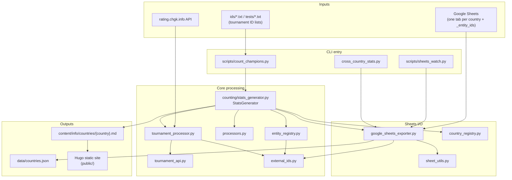
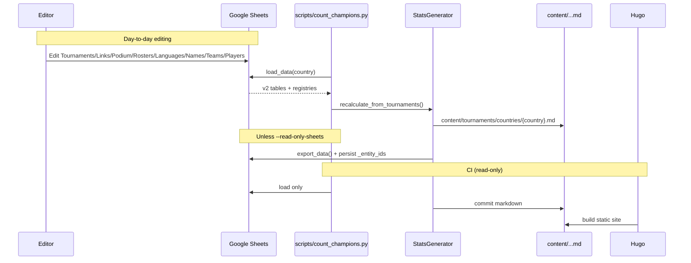

# chgk_counting — Architecture & Usage Guide

This document explains how the project is structured, how the Python modules connect to each other, how Google Sheets fits in, how outputs reach Hugo pages, and how to run every CLI mode safely.

---

## Table of contents

1. [What this project does](#what-this-project-does)
2. [High-level architecture](#high-level-architecture)
3. [Data sources and outputs](#data-sources-and-outputs)
4. [Identity model (internal + external ids)](#identity-model-internal--external-ids)
5. [File-by-file reference](#file-by-file-reference)
6. [Module dependency graph](#module-dependency-graph)
7. [Google Sheets (v2 schema)](#google-sheets-v2-schema)
8. [CLI modes — complete reference](#cli-modes--complete-reference)
9. [One-time operations](#one-time-operations)
10. [Read-only vs write-back to Sheets](#read-only-vs-write-back-to-sheets)
11. [Hugo integration](#hugo-integration)
12. [CI / GitHub Actions](#ci--github-actions)
13. [Local setup and testing](#local-setup-and-testing)
14. [Common workflows](#common-workflows)
15. [Troubleshooting](#troubleshooting)

---

## What this project does

**chgk_counting** builds national intellectual-game championship statistics for publication on [ChGKNews](https://chgknews.github.io/stats/countries/azerbaijan/)-style pages.

It:

1. **Fetches** tournament results from [rating.chgk.info](https://rating.chgk.info) (via API), and/or
2. **Reads** manually curated data from a shared **Google Spreadsheet** (one tab per country), then
3. **Assigns internal entity ids** and stores optional external ids (`ts_id`, `uz_id`, `ua_id`) for deduplication, then
4. **Recalculates** team/player medal tables and error lists from tournament/podium/roster data, and
5. **Writes** Hugo-ready country pages and, on production saves only, rewrites **`content/info/data.json`** (dump of every country tab). `--test` skips that JSON file. Aggregated stats are also assembled as an in-memory dict for Google Sheets export (`build_output_data()`).

**Google Sheets is the editable source of truth** after initial setup. Editors fix old team names, missing rosters, and results links (rating.chgk.info, [turnirlar.uz](https://turnirlar.uz/), Google Sheets, …) by hand in the spreadsheet.

---

## High-level architecture



### Typical data lifecycle



---

## Data sources and outputs

### Inputs

| Source | Used by | Purpose |
|--------|---------|---------|
| `https://api.rating.chgk.net` … `*.json` | `tournament_api.py` → `tournament_processor.py` | Live tournament info + top-3 results with rosters (HTTP JSON) |
| Google Spreadsheet (`constants.GOOGLE_SHEETS_SPREADSHEET_ID`) | `google_sheets_exporter.py` | Editable canonical data per country tab |
| `_entity_ids` worksheet | `EntityIdAllocator` | Global next internal id for team / player / tournament |
| `ids/*.txt` or `tests/*.txt` | `country_registry.resolve_country_slug()` | Bulk list of rating.chgk.info tournament IDs (newest first) |

### Outputs

| Path | Format | Purpose |
|------|--------|---------|
| `content/tournaments/countries/{country}.md` | Markdown + inline HTML tables | **Primary** Hugo page generated by `StatsGenerator` |
| `content/info/data.json` | JSON | Public dump of **every country tab** in the production spreadsheet (sheet sections). Rewritten from Google Sheets on every production save (`-ug`, `-at`, `-et`, `-u`, `-f`). `--test` does not rewrite it |
| `content/countries/{country}.md` | Markdown | Older/alternate content tree (some countries still have copies here) |
| `public/` | Static HTML | Hugo build output (gitignored locally) |

**Hugo page:** `StatsGenerator` writes **`content/info/countries/{country}.md`** (`constants.OUTPUT_MD`). `russia_01_19`, `russia_igra_tv`, and `russia_kvrm` go to **`content/info/countries/russia/{country}.md`**. `--test` writes the same filenames under **`test/`** (`constants.OUTPUT_MD_TEST`) instead.

**Public JSON:** `GoogleSheetsExporter.write_public_json()` rewrites **`content/info/data.json`** (`constants.OUTPUT_JSON`) after each production save, by reading every public worksheet. `--test` writes markdown under `test/` and may write the test spreadsheet, but **does not** rewrite this file (the test workbook must not replace the production dump). Tabs `_entity_ids` and `backup` (and any other title starting with `_`) are omitted.

Top-level keys are tab names (`uzbekiston`, `armenia`, …). Each value is the sheet layout:

| Key | Contents |
|-----|----------|
| `metadata` | `country`, `age`, `intro`, `generated_at`, `numbers_champ`, counts |
| `tournaments` | list of Tournaments rows (dicts keyed by column header) |
| `links` | Links rows |
| `podium` | Podium rows |
| `rosters` | Rosters rows |
| `individuals` | Individuals rows |
| `languages` | Languages rows |
| `names` | Names rows |
| `teams` | Teams registry rows |
| `players` | Players registry rows |
| `errors` | `{description, items: [{id, description, critical}, …]}` from the Errors section |

---

## Identity model (internal + external ids)

Every **team**, **player**, and **tournament** has:

| Field | Meaning |
|-------|---------|
| `id` | **Internal** auto-increment integer, unique across all countries |
| `external_ids` | Extensible map of optional foreign keys (at most one value per source) |

Known external sources (`constants.EXTERNAL_ID_SOURCES`):

| Key | Source |
|-----|--------|
| `ts_id` | [rating.chgk.info](https://rating.chgk.info) |
| `uz_id` | [turnirlar.uz](https://turnirlar.uz/) |
| `ua_id` | Ukrainian rating site (`https://rating.chgk.com.ua/tournament/{ua_id}`) |

### Deduplication rules

When importing from rating.chgk.info (or resolving an entity with an external id):

1. Look up `(source, external_id)` in `EntityRegistry`
2. If found → reuse that internal `id`
3. If not found → allocate a new internal `id` and index the external id
4. Name-only entities (no external ids) always get a **new** internal id (no fuzzy name matching)

Medal tables (`Awardee`) are keyed by **internal** `id` and also store `external_ids`.

### Global counters

`EntityIdAllocator` keeps `next_team_id` / `next_player_id` / `next_tournament_id` on the `_entity_ids` worksheet. On each write-back export, counters are persisted so the next country run continues from the same sequence.

### Results links (multi-source)

Tournament results are **not** limited to rating.chgk.info:

| Source of URL | How it appears |
|---------------|----------------|
| Explicit `results` cell | Any URL (rating.chgk.info, turnirlar.uz, Google Sheets, …) |
| Derived from `ts_id` | `https://rating.chgk.info/tournament/{ts_id}` when `results` is empty |
| Derived from `uz_id` | `https://turnirlar.uz/tournament/{uz_id}` when `results` is empty |
| Google Sheets | Must be entered in `results` (cannot be derived from an id) |

Markdown shows a results line only when `resolve_results_url()` returns a non-empty URL. Link labels depend on the host («турнирном сайте», «Turnirlar.uz», «таблице результатов», or generic «странице результатов»).

Helpers live in `external_ids.py`: `resolve_results_url()`, `results_markdown_label()`, `parse_external_id_from_results_url()`.

### Place ranking (ties)

Podium places come from the API `position` field using **competition ranking**: a team’s place is the number of teams that finished strictly ahead. Tied teams share the same place (several Podium rows may share place `1`, etc.). The higher medal is awarded to all tied teams.

Markdown year anchors are always `{game}_{year}` (e.g. `chgk_2025`), whether the country has one game or several.

---

## File-by-file reference

CLI entry points live in `scripts/`. Library modules live in `counting/` and are imported as `from counting.<module> import ...`.

### Entry points

#### `scripts/count_champions.py`
**Role:** Main CLI. Parses arguments and delegates to `StatsGenerator` or auxiliary scripts.

**Imports:** `counting.country_registry`, `counting.stats_generator`

**Key flags:** `-f`, `-cn`, `-ug`, `-at`, `-et`, `-u`, `--read-only-sheets`, `--test`, `--cross-country-stats`, `--check-doubles`, `--replace-doubles`

**`-u` types:** `ts`, `results`, `place`, `announce`, `tg`, `fb`, `vk`, `site`, `recap`, `letopis`, `photos`, `questions`

#### `scripts/sheets_watch.py`
**Role:** CI helper. Compares spreadsheet `modifiedTime` and per-tab content hashes against `.github/sheets_state.json`. Prints `CHANGED:poland,testing` or `UNCHANGED`.

#### `scripts/cross_country_stats.py`
**Role:** Optional analytics. Loads all country tabs; matches players across countries preferably by `ts_id`, falling back to internal id when no external id is present.

#### `scripts/check_doubles.py`
**Role:** Build tournament/team/player sets from every country tab and write pairs that share `ts_id` / `uz_id` / `ua_id` to the `doubles` sheet. Same check runs after `-at`, `-f`, `-ug`, `-et`, `-u`. `--read-only-sheets` prints pairs without writing.

#### `scripts/replace_doubles.py`
**Role:** Read `doubles`, and for rows with `replace?` = `yes` replace `id2` with `id1` in all country tabs, then move those rows to the bottom of `doubles`.

#### `scripts/generate_calendar.py`
**Role:** Builds `data/calendar.json` and `content/info/calendar.md` from the public Google Sheet.

#### `scripts/generate_chronicle.py`
**Role:** Builds chronicle markdown from a Google Doc.

---

### Orchestration

#### `stats_generator.py`
**Role:** Central orchestrator. Owns the full pipeline: fetch/process → resolve ids → aggregate stats → optionally export Sheets → generate markdown.

**Class:** `StatsGenerator(country, read_only_sheets=False)` — creates `EntityIdAllocator` + `EntityRegistry` (loads `_entity_ids` when Sheets is available).

| Method | Purpose |
|--------|---------|
| `generate_stats()` | Bulk mode: process tournament ID list from API (validates country slug first) |
| `recalculate_from_tournaments()` | Seed registry from loaded entities, rebuild team/player/errors dicts |
| `update_from_google_sheets()` | Load tab → recalculate → save |
| `add_tournament()` | Load tab, fetch one new tournament from API, append |
| `add_empty_tournament()` | Load tab, append placeholder with a new internal tournament id |
| `update_tournament()` | Fill empty slot: `ts` (API), `results` (any URL), place, or link columns |
| `build_output_data()` | Snapshot including Teams/Players registries for Sheets export |
| `_save_results()` | Merge Errors from the sheet with auto-detected gaps, then export Sheets + JSON + markdown |
| `_process_single_tournament()` | Unified path for API fetch OR sheet-loaded tournament (dedup by external id) |
| `_generate_markdown_files()` | Write `content/info/countries/{country}.md` (Russia specials under `…/russia/`) using `meta.intro` (always visible) and tabbed sections |
| `_finalize_errors()` | Keep editor Errors rows/description/`critical`; add newly detected missing-data rows |
| `_default_intro()` | First-time «Чемпионаты … проводятся с {year} года.» (age-aware plural) from earliest tournament year |
| `_championships_heading()` | Plural title from `meta.age`: «Студенческие чемпионаты России» |
| `_tournament_tab_label()` | One tab: «Чемпионаты»; `chgk`: «Турниры по ЧГК»; two or more of `chgk`/`kvrm`/`zakovat`/`od`: «Турниры по КВРМ»; other games: «Турниры по {GAMES_SHORT_NAMES}» |
| `_year_section_keys()` | Collapse `chgk`/`kvrm`/`zakovat`/`od` into one `kvrm` tab when several of them are present |
| `_write_game_tournaments()` | Year list + edition blocks for one tab (one game, or the merged КВРМ group) |

**Imports:** `google_sheets_exporter`, `tournament_processor`, `processors`, `country_registry`, `entity_registry`, `external_ids`, `data_errors`, `sheet_utils`, `models`, `constants`, `t_fashion`

---

### Identity helpers

#### `external_ids.py`
**Role:** Normalize/merge external-id maps; classify and resolve results URLs; parse `ts_id`/`uz_id` from known tournament page URLs; `missing_data_tournament_url()` for the Нет данных table. No model imports (safe for `models.py` to use).

#### `languages.py`
**Role:** Known tournament languages (`LANGUAGES`: ISO code → Russian name, prepositional form, optional phrase override). Normalizes codes/names coming from Sheets, JSON and the API, and builds the markdown phrase «на русском и испанском языках» / «на иврите». No model imports.

#### `entity_registry.py`
**Role:**

| Class | Purpose |
|-------|---------|
| `EntityIdAllocator` | Global auto-increment; load/persist `_entity_ids` |
| `EntityRegistry` | Resolve/observe teams, players, tournaments by external id; allocate when unknown; `remember_foreign_ids()` indexes other countries so API imports reuse an existing id |

---

### Google Sheets

#### `google_sheets_exporter.py`
**Role:** Load/export country worksheets in the v2 schema (Tournaments, Links, Podium, Rosters, Languages, Names, Teams, Players, Errors). Also dumps all public tabs to `content/info/data.json` (not when `--test` / the test spreadsheet is in use).

**Class:** `GoogleSheetsExporter`

| Method | Purpose |
|--------|---------|
| `load_data(country)` | Parse worksheet → `{tournaments, teams, players, meta, ...}` |
| `export_data(country, output_data)` | `worksheet.clear(fields="*")` then write full v2 layout with `parse=False` |
| `write_public_json()` | Read every public tab and rewrite `content/info/data.json` (skipped for the test spreadsheet) |
| `list_country_worksheets()` | Country tab titles (skips `_entity_ids`, `doubles`, `backup`, other `_…` tabs) |
| `_join_tables()` | Join Tournaments + Links + Podium + Rosters + Languages + Names + registries → `TournamentData` |
| `_build_v2_rows()` | Serialize metadata + sections including Errors |

**Credentials:** `credentials.json` (`constants.GOOGLE_SHEETS_CREDENTIALS`)

**Spreadsheet:** `constants.GOOGLE_SHEETS_SPREADSHEET_ID`. `--test` on `count_champions.py` switches to `GOOGLE_SHEETS_TEST_SPREADSHEET_ID`.

#### `sheet_utils.py`
**Role:** Link keys, table headers (`TOURNAMENT_HEADERS`, `LINK_HEADERS`, `PODIUM_HEADERS`, `ROSTER_HEADERS`, `TEAM_REGISTRY_HEADERS`, `PLAYER_REGISTRY_HEADERS`, `ERROR_HEADERS`), `roster_complete` parsing, sheet id formatting, `parse_sheet_int()` / `parse_sheet_id()` (integers from date-formatted cells and Sheets floats like `147.0`), profile URLs from `external_ids.ts_id`.

#### `data_errors.py`
**Role:** Missing-data phrases, auto-detection of incomplete rosters/medalists/date/city on past editions, merge with the Sheets Errors section (`critical` yes/no, default yes). Future tournaments are never reported.

#### `doubles.py`
**Role:** `EntitySets` of tournaments/teams/players across all country tabs; detect pairs that share `ts_id`/`uz_id`/`ua_id`; read/write the `doubles` worksheet; replace `id2` with `id1` when `replace?` is `yes`.

#### `country_registry.py`
**Role:** Maps latin slug (`poland`) → Cyrillic nominative/genitive for markdown. Single source of truth for country names (`get_country_nominative()`, `get_country_genitive()`, `validate_country_slug()`). Optional `output_subdir` sends markdown to a nested Hugo folder (`russia_01_19` / `russia_igra_tv` / `russia_kvrm` → `content/info/countries/russia/{slug}.md`). `resolve_country_slug()` parses bulk input files. There is **no** runtime `register_country()` — names are not stored in Sheets metadata.

---

### API & tournament processing

#### `tournament_api.py`
**Role:** HTTP client for `api.rating.chgk.net`. Fetches tournament `*.json` endpoints with retries.

#### `tournament_processor.py`
**Role:** Converts raw API JSON into `Team` / `Player` with `external_ids={ts_id: ...}` (internal `id=0` until the registry allocates). Filters national-team flagged entries when present.

#### `t_fashion.py`
**Role:** Russian date formatting, city name inflection, Russian date parsing for `-et` empty tournaments, `normalize_tournament_dates()`. Accepts incomplete ISO dates (`1995-00-00`, `1995-08-00`) and formats them as prepositional phrases («в 1995 году» / «в августе 1995 года»).

#### `processors.py`
**Role:** `count_champions()` — increments gold/silver/bronze/sum and per-game `by_game` on `Awardee` dicts keyed by **internal** id; merges `external_ids`. `medal_column_groups()` decides which I/II/III game blocks appear in the markdown tables: `chgk`+`kvrm`+`zakovat`+`od` medals are **summed** into one block titled **КВРМ** when two or more of those games have medals (same pattern for `brain`+`tables` → **БР**, `ssi`+`ssi_f` → **ССИ**).

---

### Data models

#### `models.py`
**Role:** Dataclasses for the domain:

| Class | Represents |
|-------|------------|
| `Awardee` | Aggregated team or player medal stats (`id` internal + `external_ids` + per-game `by_game`) |
| `Player` | Player (`id` internal, `external_ids`, name, surname) |
| `Team` | Team with roster (`id` internal, `external_ids`, name, city, players) |
| `TournamentAwardee` | One team's placement; team `old_name` is display-only (does not overwrite `team.name`) |
| `Team` | `non_russian_name` → markdown `NonRu («Cyrillic»)` via `display_name()` |
| `Player` | Registry: `non_russian_*`; roster-only: `old_name`/`old_surname` for year winner lists |
| `TournamentData` | Championship edition (`id` internal, `external_ids`, number, dates, city, year, awardees, links, `comment`) |
| `MetaData` | Country slug, counts, `numbers_champ` per game, `intro` (markdown opening sentence), `age` (championship age category) |

All have `to_dict()` / `from_dict()` for Sheets round-trips. Loaders accept missing `city`/`number`, empty `game` (defaults to `chgk`), Sheets float ids (`147.0`), and sheet-shaped metadata (`team_count` next to nested `statistics`).

---

### Configuration

#### `constants.py`
**Role:** UI strings, game name aliases, `OUTPUT_MD` / `OUTPUT_MD_TEST`, `TOP_PLACES = 3`, `NATIONAL_TEAM_FLAG_ID`, `EXTERNAL_ID_*` sources, `ENTITY_IDS_WORKSHEET`, Google Sheets IDs.

#### `requirements.txt`
```
requests
pygsheets
roman-arabic-numerals
```

#### `.gitignore`
Ignores `public/`, `credentials.json`, `__pycache__/`, venvs.

---

### CI & automation

| File | Role |
|------|------|
| `.github/workflows/rebuild-from-sheets-manual.yaml` | Manual: rebuild country slug(s) from Sheets (`-ug`), commit outputs |
| `.github/workflows/add-country-from-file-manual.yaml` | Manual: bulk load from tournament ID file (`-f`), commit outputs |
| `.github/sheets_state.json` | Worksheet hash state updated by `sheets_watch.py` |
| `.github/CI_SETUP.md` | GitHub secrets and workflow inputs |
| `scripts/google_apps_script.gs` | Optional debounced `onEdit` → GitHub `repository_dispatch` |

---

### Hugo site (this repo)

| File / dir | Role |
|------------|------|
| `hugo.toml` | Site config (`theme = 'LucentLink'`, Russian locale) |
| `themes/LucentLink/` | Git submodule — theme |
| `archetypes/default.md` | Hugo content template |
| `public/` | Build output (generated, gitignored) |

---

## Module dependency graph

```
scripts/count_champions.py
├── counting.country_registry
└── counting.stats_generator
    ├── counting.constants
    ├── counting.country_registry
    ├── counting.entity_registry
    │   ├── counting.constants
    │   ├── counting.external_ids
    │   └── counting.models
    ├── counting.external_ids → counting.constants
    ├── counting.google_sheets_exporter
    │   ├── counting.constants
    │   ├── counting.external_ids
    │   ├── counting.languages
    │   ├── counting.models
    │   ├── counting.sheet_utils
    │   └── counting.t_fashion
    ├── counting.languages
    ├── counting.models → counting.external_ids, languages, sheet_utils, constants, t_fashion
    ├── counting.processors → counting.models, counting.external_ids
    ├── counting.sheet_utils → counting.constants, counting.external_ids
    ├── counting.t_fashion
    └── counting.tournament_processor
        ├── counting.constants
        ├── counting.languages
        ├── counting.models
        ├── counting.t_fashion
        └── counting.tournament_api → requests

scripts/sheets_watch.py → counting.google_sheets_exporter
scripts/cross_country_stats.py → counting.google_sheets_exporter, counting.external_ids, counting.constants
```

---

## Google Sheets v2 schema

One **worksheet tab per country**. Tab name = latin slug (`poland`, `azerbaijan`, `testing`).

Tabs starting with `_` are ignored when listing country worksheets. The special tab `_entity_ids` holds global internal-id counters. A tab named `backup` is also omitted from the public JSON dump.

### Section 1: Metadata (top rows)

```
metadata
country          | poland
age              | adult
intro            | Чемпионаты Польши проводятся с 2018 года.
generated_at     | 2026-07-12T22:25:37
number_champ_chgk| 24
team_count       | 42
player_count     | 128
tournament_count | 24
```

Cyrillic country names are resolved from `COUNTRY_REGISTRY` by slug (`get_country_genitive()` / `get_country_nominative()`). A legacy `cyrillic_name` metadata row is ignored.

- `age`: `adult` (default) / `youth` / `student` / `school` / `juvenal` / `child`. Blank or unknown cells become `adult`. Applies to every tournament on the tab. Changes the championship title: «молодёжный / студенческий / школьный / детский чемпионат», or «чемпионат {country} среди ювеналов (8–9 классы)». Recalculate (`-ug`) and later CLI adds keep the sheet value
- `intro`: opening sentence in markdown (`Чемпионаты Польши проводятся с 2018 года.`). Created **once** when tournaments are added from the CLI (`-f`, `-at`, `-et`) from the earliest tournament year. Recalculate (`-ug`) and later CLI adds keep the sheet value, so an editor can correct the year without it being overwritten. Markdown always prints this cell; it does not recompute `min(year)`.

### Section 2: Tournaments

Header: `id | number | game | start_date | end_date | city | year | countable | ts_id | uz_id | ua_id | comment`

One row per championship edition. Country is **not** repeated here — it lives in metadata and in the worksheet tab name. URLs live in the **Links** table, not on this row.

- `id`: **internal** auto-increment id (global via `_entity_ids`)
- `countable`: `yes` / `no`. **Only `yes` counts** — a blank cell, a missing column or an unrecognized value all mean `no`, so manually entered editions must be marked explicitly. Podium fetched from rating.chgk.info (`-f`, `-at`, `-u ts`) is written as `yes`. Affects the podium medal tables (Команды / Игроки) only: an uncountable edition still appears in that game’s tournament tab with its podium and roster, still contributes to `tournament_count` and still reports incomplete rosters
- `ts_id` / `uz_id` / `ua_id`: optional external ids; at most one value per source; extensible via `constants.EXTERNAL_ID_SOURCES`
- `start_date`, `end_date`: **ISO `YYYY-MM-DD`**. Single-day events set both equal. Unknown month or day may be `00`: `1995-00-00` (year only) or `1995-08-00` (year and month). These stay as written in the sheet (they are not normalized to a real calendar day). Markdown uses the same order as a full date: «прошёл **в 1995 году** в Тель-Авиве» / «прошёл **в августе 1995 года** в Тель-Авиве». A full date reads «прошёл 21 августа 1995 года в Тель-Авиве». Year-only is treated as finished after that calendar year; month-only after the last day of that month
- `city`: city name in **prepositional case** (“прошёл … **в** {city}”, e.g. `Будве`). Empty city: «{title} прошёл/пройдёт {date}. Город проведения пока неизвестен.»
- `comment`: optional free-text note, filled **only in the sheet** (CLI/API never set it). Markdown prints it after the second- and third-place sentence, before «Полные результаты…». Recalculate round-trips the cell as-is

### Section 3: Links

Header: `id | results | announce | site | tg | fb | vk | recap | letopis | photos | questions`

One row per tournament that has at least one URL, keyed by the tournament's internal `id`.

- `id`: same internal id as the Tournaments row
- `results`: optional URL to full results — any host. Markdown shows a results line when this cell is set **or** a `ts_id`/`uz_id` can derive a default page URL. Google Sheets links must be entered here. CLI: `-u results -ui <url>` also fills `ts_id`/`uz_id` when the URL is a known tournament page
- `questions`: appended to the results sentence — «Полные результаты можно найти [на турнирном сайте](…), вопросы турнира можно почитать [здесь](…).»
- `photos`: a following sentence — «Фотографии с турнира можно посмотреть по [этой ссылке](…).»
- Other columns: optional announcement / site / social / recap / chronicle URLs
- A tournament with no URLs has no Links row. Older Tournaments rows that still contain these columns still load; the next export moves them here

### Section 4: Podium

Header: `id | place | team id | team name | old name | team city | roster_complete`

- `id`: same internal tournament id as the Tournaments row (`game` and `year` come from that row)
- `place`: 0 = gold, 1 = silver, 2 = bronze (competition ranking from API `position`; ties share a place)
- `old name`: historical display override for markdown only; never overwrites `team name` on load/export
- `team id`: **internal** team id (see Teams registry)
- `roster_complete`: `yes` / `no` — if `no`, or if `yes` but no Rosters rows loaded for that medalist, the edition is listed in Errors / **Нет данных** (past tournaments only)

**Team-only rows are valid** — podium without roster rows is allowed.

### Section 5: Rosters

Header: `id | place | team id | player id | player name | player surname | old_name | old_surname`

- One row per player
- `id`: same internal tournament id as the Tournaments row (`game` and `year` come from that row)
- `team id` / `player id`: **internal** ids (see Teams / Players registries)
- `team id` disambiguates rosters when tied teams share the same `place`. Load matches Podium by tournament id, then place + team id; if place is blank it still attaches when that `team id` appears once on the podium. Unmatched rows are reported and skipped, not silently dropped.
- `old_name` / `old_surname`: per-tournament historical names; when either is set, year-section winner rosters print **only** the old name line, and the Players hall-of-fame shows `Current Name (Old Name)`

### Section 6: Individuals

Header: `id | place | player id | player name | player surname | old_name | old_surname | sex`

Podium for **individual** games (`constants.INDIVIDUAL_GAMES`: `ssi`, `ssi_f`). There is no team: one row is one medalist.

- `id`: same internal tournament id as the Tournaments row (`game` must be an individual game)
- `place`: 0 = gold, 1 = silver, 2 = bronze; several rows may share a place (ties)
- `player id`: **internal** player id (see Players registry)
- `sex`: `male` / `female` / `other` (blank or unknown → `male`). Year-section verbs: «занял» / «заняла» / «заняли». Ties at a place still use «разделили»
- Medals go **only** to the Игроки table, never Команды
- Year-section prose names the player (`Победитель: **Имя Фамилия**`), not a team
- Podium / Rosters rows on an individual tournament are ignored
- A missing player name on a countable edition is reported like an incomplete roster
- Fewer than three named prize-winners: the edition block adds `На этом турнире часть призёров неизвестна…` (`INDIVIDUAL_PRIZERS_INCOMPLETE`, contact `CONTACT_EMAIL`)
- Links / Languages / Names / `comment` / external ids on the same tournament `id` are loaded and printed exactly as for team games
- Individual games are **never** imported from the rating API (`-f`, `-at`, `-u ts` refuse `ssi` / `ssi_f`). Medalists and edition rows are entered only in the sheet

### Section 7: Languages

Header: `id | language | name`

One row per language, so an edition played in two languages gets two rows. Order of rows is the order used in the markdown sentence.

- `id`: same internal tournament id as the Tournaments row
- `language`: ISO 639-1 code (`ru`, `es`, `he`, …) as used by [the rating API](https://api.rating.chgk.net/languages). Export always writes the code; on load a Russian name (`Испанский`) typed by hand is accepted too
- `name`: Russian name, written on export for readability only — `language` wins on load
- Known codes live in `languages.py`; the API list is a subset of it, since it has no Spanish, Turkish, Hebrew and so on. An unknown value is reported and skipped, so add the language to `LANGUAGES` before using it
- Tournaments imported from the API (`-f`, `-at`, `-u ts`) take their languages from the tournament payload; `-u ts` never overwrites languages already present in the sheet
- Markdown, year list in the game tab: a single non-Russian language is named next to the year — `V чемпионат Армении (2022, на армянском языке)`. An edition with several languages keeps the plain `(2022)`
- Markdown, tournament block: a non-Russian language adds a sentence after the date/city one, on the same line — «Вопросы задавались на армянском языке.» once `end_date` is past, «Вопросы будут задаваться на армянском языке.» while it is ahead. Several languages give «…на русском и армянском языках», Hebrew gives «…на иврите». Russian alone (or no rows at all) adds nothing

### Section 8: Names

Header: `id | name`

Title override for a single edition, keyed by the tournament's internal `id`.

- `id`: same internal id as the Tournaments row
- `name`: the complete title, used verbatim: `Кубок Армении`, `Мемориал Иванова`. It replaces `V чемпионат Армении` in the edition block **and** in the year list at the top of that game’s tab
- An edition with no row here keeps the usual numbered title. A name without a matching tournament id is ignored
- Older `number | game | year | name` rows still load (joined by that key); the next export rewrites them as `id | name`

### Section 9: Teams (registry)

Header: `id | name | non_russian_name | city | ts_id | uz_id | ua_id`

Canonical team records. Podium rows reference `id`. External ids deduplicate API imports (`ts_id` match → reuse internal id).

- `non_russian_name`: optional; markdown shows `ჯაგერჯაუტი («Джаггернаут»)` (non-Russian first, Cyrillic/`old name` in «») everywhere teams appear

### Section 10: Players (registry)

Header: `id | name | surname | non_russian_name | non_russian_surname | ts_id | uz_id | ua_id`

Same rules as Teams. Medal tables use internal ids and also keep `external_ids` on each `Awardee`.

- `non_russian_name` / `non_russian_surname`: stored in Sheets only for now (not shown in markdown yet)

### Section 11: Errors

Always present on export, even when there are no rows.

```
Errors
description | Также не хватает данных о чемпионатах страны 1993 и 1995 годов
id          | description                                      | critical
12          | неизвестен состав победителя.                    | yes
18          | неизвестна точная дата проведения.               | no
```

- `description`: extra sentence for the **Нет данных** tab (after the fixed intro). Editors may change it; `-ug` keeps the cell
- `id` | `description` | `critical`: one row per edition (internal tournament id). Editors may add, edit, or delete rows. `-ug` keeps existing text and **adds** newly detected gaps
- `critical`: `yes` or `no`, set by hand in the sheet. Blank cells and newly detected rows default to `yes`. `yes` rows appear in the country markdown **Нет данных** table; `no` rows stay in the sheet (and in `data/countries.json`) but are omitted from markdown
- Auto-detected (past editions only): incomplete/missing winner or 2nd/3rd rosters (team) or medalists (SSI), incomplete date (not a full day–month–year), missing city
- Future editions (`пройдёт`, or a year still ahead with no date) are not written here
- Markdown tab **Нет данных** is omitted when both the extra sentence and the **critical** item list are empty; the sheet section remains

### Tab: doubles

Not a country worksheet. Skipped by the public JSON dump (`SKIP_WORKSHEET_TITLES`). Created on first duplicate scan.

Header: `kind | ts_id | uz_id | ua_id | id1 | name1 | surname1 | id2 | name2 | surname2 | replace?`

- One row per pair of **different internal ids** that share `ts_id`, `uz_id` or `ua_id` (any one is enough). The same person/team in two countries with the **same** internal id is not a double
- `kind`: `tournament` / `team` / `player` (required because those id sequences are independent)
- `id1` is the smaller internal id (kept on merge), `id2` is the larger (replaced)
- `surname1` / `surname2` are filled for players; teams and tournaments leave them blank
- `replace?` is blank on new rows and is **never** filled by the scripts — editors type `yes` by hand
- `-at` / `-f` / `-ug` / `-et` / `-u` refresh this tab after a save (unless `--read-only-sheets`). Standalone: `python scripts/check_doubles.py`
- `python scripts/replace_doubles.py` rewrites `id2` → `id1` in every country tab where `replace?` is `yes`, then sorts the tab so those `yes` rows sit at the bottom

### Join logic

On load, `_join_tables()` builds `TournamentData` objects from Tournaments rows. Child tables join by tournament internal `id`. A leftover `country` column on an old sheet is ignored. 

1. Tournaments rows → base records (internal `id` + `external_ids` + `comment`)
2. Links rows → `TournamentData.links` by tournament `id` (leftover URL columns on old Tournaments rows still fill empty keys)
3. Teams / Players registries → attach external ids (and names when podium/roster cells are sparse)
4. Podium rows → `TournamentAwardee` by tournament `id` (then `place` + internal `team id`); skipped when `game` is individual (`ssi`)
5. Rosters rows → `Player` objects on the matching awardee (by tournament `id`, place + internal `team id`); skipped for individual games
6. Individuals rows → one `TournamentAwardee` per player (no team) on individual tournaments (`ssi`, `ssi_f`), by tournament `id`
7. Languages rows → `TournamentData.languages` by tournament `id` (ISO codes, duplicates and unknown values dropped)
8. Names rows → `TournamentData.display_name` by tournament `id`

**Derived stats are always recalculated** from these tables. Export writes Teams/Players registries collected from tournament data (and any explicit registries in `output_data`).

### What editors can add manually

- **Future championship (no results):** Tournaments row only → upcoming/empty edition in that game’s tab
- **Results without rosters:** Tournaments + Podium → team medals update; player stats incomplete
- **Full results:** Tournaments + Podium + Rosters (+ registry rows on next export) → team and player stats
- **SSI / individual results:** Tournaments (`game` = `ssi` or `ssi_f`) + Individuals rows → player medals only; the game tab lists people, not teams. **Links, Languages, Names, `comment`, dates, city and `ts_id`/`uz_id` are the same columns as for team games** and appear in the edition block the same way (`Полные результаты…`, `Больше информации…`, language sentence, title override)
- **Results URL only:** add a Links row with `results` (turnirlar.uz / Google Sheets / any URL); optionally set `uz_id` / `ts_id` on Tournaments
- **Tournament comment:** set `comment` on the Tournaments row; markdown shows it after the date/places sentence (team or SSI)

Ignored:

- Podium without a matching Tournaments row
- Rosters without a matching Podium row

---

## CLI modes — complete reference

All commands assume:
```bash
cd /path/to/chgk_counting
source .venv/bin/activate   # optional but recommended
pip install -r requirements.txt
# credentials.json present for any Sheets operation
```

### 1. Bulk load from API (`-f`) — first-time country setup

Fetches every tournament ID from rating.chgk.info, assigns championship numbers in file order (newest first), allocates internal ids (dedup by `ts_id`), writes local markdown, **and exports to Google Sheets by default** (also updates `_entity_ids`). `-g ssi` / `-g ssi_f` is refused — individual games are sheet-only.

```bash
python scripts/count_champions.py -f ids/azerbaijan.txt -cn azerbaijan
python scripts/count_champions.py -f poland.txt -cn poland -n 24
python scripts/count_champions.py -f poland.txt -cn poland -g brain
python scripts/count_champions.py -f tests/testing2.txt -cn testing2 --read-only-sheets
```

**Input file format:**
```
country: poland
# comments allowed
11708
11707
```

Slug resolution priority: `-cn` flag > `country:` header > first non-numeric line > filename stem.

Unknown slugs fail immediately via `validate_country_slug()` before any API download.

---

### 2. Rebuild from Google Sheets (`-ug`) — day-to-day

Reads the country tab, recalculates all stats, writes local files.

```bash
python scripts/count_champions.py -ug testing
python scripts/count_champions.py -ug testing --read-only-sheets
```

---

### 3. Add one tournament from API (`-at`)

```bash
python scripts/count_champions.py -cn poland -at 11708
python scripts/count_champions.py -cn poland -at 11708 -g brain
```

Requires an existing worksheet tab with metadata (`number_champ_*`). Matches existing teams/players by `ts_id` when possible. `-g ssi` / `-g ssi_f` is refused — add individual editions in the sheet.

---

### 4. Add empty upcoming tournament (`-et`)

```bash
python scripts/count_champions.py -cn poland -et "25 февраля 2026 года" -p "Варшаве"
```

Allocates a new internal tournament `id` with no external ids yet.

---

### 5. Update tournament (`-u` / `-ui`)

Without `-g`, finds the most recent edition **without awardees** (any team game; individual empties are skipped for `-u ts`). With `-g`, prefers an empty edition of that game.

Link and city updates (`results`, `tg`, `place`, …) can also land on the newest **already-filled** edition of `-g`, so an SSI / SSI-with-false-starts row that already has Individuals still picks up a results URL the same way as a team game. `-u ts` fetches from the rating API and is refused for `ssi` / `ssi_f` — enter Individuals in the sheet.

```bash
# Fetch podium/rosters from rating.chgk.info (sets results + ts_id). Not allowed for SSI / SSI with false starts.
python scripts/count_champions.py -cn poland -u ts -ui 11708

# Add a results URL to the newest SSI edition (even if Individuals are already filled)
python scripts/count_champions.py -cn uzbekiston -g ssi -u results -ui "https://rating.chgk.info/tournament/12345"

# Set results URL from any host (fills ts_id/uz_id when URL is a known tournament page)
python scripts/count_champions.py -cn poland -u results -ui "https://turnirlar.uz/tournament/1373"
python scripts/count_champions.py -cn poland -u results -ui "https://docs.google.com/spreadsheets/d/.../edit"

# City / other links
python scripts/count_champions.py -cn poland -u place -ui "Варшаве"
python scripts/count_champions.py -cn poland -u announce -ui "https://..."
python scripts/count_champions.py -cn poland -u tg -ui "https://t.me/..."
python scripts/count_champions.py -cn poland -u vk -ui "https://vk.com/..."
python scripts/count_champions.py -cn poland -u site -ui "https://..."
python scripts/count_champions.py -cn poland -u recap -ui "https://..."
python scripts/count_champions.py -cn poland -u letopis -ui "https://..."
python scripts/count_champions.py -cn poland -u photos -ui "https://..."
python scripts/count_champions.py -cn poland -u questions -ui "https://..."
```

---

### 6. Cross-country player stats

```bash
python scripts/count_champions.py --cross-country-stats
```

Prints players who appear in more than one country's championship in the same year (identity via `ts_id` when available).

---

### 7. Duplicate entities (`doubles` tab)

```bash
python scripts/check_doubles.py
python scripts/count_champions.py --check-doubles
python scripts/check_doubles.py --read-only-sheets

# After setting replace?=yes on the doubles tab:
python scripts/replace_doubles.py
python scripts/count_champions.py --replace-doubles
```

The check also runs after `-at`, `-f`, `-ug`, `-et` and `-u`. It matches **only** `ts_id`, `uz_id` and `ua_id`. On merge, `id2` (larger internal id) is rewritten to `id1` everywhere, then `yes` rows are sorted to the bottom of `doubles`.

---

## One-time operations

Day-to-day editing uses `-ug` (see [README](../README.md)).

### Sheets change detection (optional helper)

```bash
python scripts/sheets_watch.py
# Output: CHANGED:testing,poland  or  UNCHANGED
```

Not used by current GitHub Actions workflows.

---

## Read-only vs write-back to Sheets

| Command | Reads Sheets | Writes Sheets | Writes local markdown |
|---------|-------------|---------------|----------------------|
| `-f` (bulk) | No* | **Yes** (default) + `_entity_ids` + `doubles` | Yes |
| `-f --read-only-sheets` | No | No | Yes |
| `-ug` | Yes | **Yes** (default) + `_entity_ids` + `doubles` | Yes |
| `-ug --read-only-sheets` | Yes | No | Yes |
| `-at`, `-et`, `-u` | Yes | **Yes** (default) + `_entity_ids` + `doubles` | Yes |
| `--cross-country-stats` | Yes | No | No |
| `--check-doubles` | Yes | **Yes** (`doubles` tab) | No |
| `--check-doubles --read-only-sheets` | Yes | No | No |
| `--replace-doubles` | Yes | **Yes** (country tabs + `doubles`) | Yes (affected countries) |

\*Bulk `-f` does not read the country tab first but **does export** unless `--read-only-sheets` is set. It still loads `_entity_ids` when Sheets is available so new internal ids stay globally unique, and it indexes `ts_id`/`uz_id`/`ua_id` from other country tabs so new entities reuse an existing internal id.

### What “full tab rewrite” means

`export_data()` calls `worksheet.clear(fields="*")` then `update_values(..., parse=False)`:

- Clears **values and formats** (avoids date-formatted integer cells in Podium)
- Writes values unparsed so ISO dates stay plain text
- Manual cell formatting, notes, and extra columns are **lost**
- Blank/zero internal ids export as empty cells (`format_sheet_id()`)

---

## Hugo integration

### What Python produces

`content/info/countries/{country}.md` (or `content/info/countries/russia/{country}.md` for `russia_01_19`, `russia_igra_tv`, `russia_kvrm`) — front matter uses Cyrillic **title**; body heading uses **header**. Year section anchors are `{game}_{year}` (e.g. `#chgk_2025`).

Page layout, top to bottom:

1. Title and `meta.intro` (always visible; not inside a tab)
2. Tab bar: **Команды**, **Игроки**, then tournament tabs
   - one tournament tab: label **Чемпионаты** (`CHAMPIONSHIPS_TAB`)
   - several tabs: **Турниры по {short name}** (`TOURNAMENTS_TAB_PREFIX`)
   - `chgk` / `kvrm` / `zakovat` / `od` collapse into one tab when two or more of them are present (`PRIMARY_GAMES_ANCHOR` = `kvrm`, label **Турниры по КВРМ**)
   - a standalone `chgk` tab is **Турниры по ЧГК** (`GAMES_COLUMN_NAMES`); other games keep `GAMES_SHORT_NAMES` («Турниры по ССИ», «Турниры по БР», …)
3. Tab panels. Hugo Goldmark does not parse markdown inside a wrapping `<div>`, so the generator writes empty `.country-tab-start` / `.country-tab-end` markers around markdown; inline JS moves those sibling nodes into `.country-tab-panel`. A hash (`#players`, `#chgk_2024`, `#game-ssi`) opens the matching tab
4. **Нет данных** tab (only when there is something to show): fixed intro «Ниже собрана информация о том, каких данных не хватает в том или ином турнире.» plus the Errors `description` cell, then a table Год / Турнир / Чего не хватает. Tournament names use `GAMES_COLUMN_NAMES` (по ЧГК). The name is a link to rating.chgk.info when `results` is that host or `ts_id` is set; otherwise `ua_id` (`rating.chgk.com.ua`); otherwise plain text

There is no contents list, no «Зал славы», and no «Наверх» / «К списку турниров» links.

Championship titles take `game` from each tournament and `age` from metadata:

- Year list at the top of each game tab uses `GAMES_SHORT_NAMES`: `X чемпионат России по спортивному ЧГК` (plus age: `молодёжный` / `студенческий` / `школьный` / `детский чемпионат`, or `чемпионат России среди ювеналов (8–9 классы)`)
- Tournament blocks use `GAMES_FULL_NAMES_CASE`: `X чемпионат России по спортивному «Что? Где? Когда?» прошёл…` when `end_date` is past, `пройдёт…` when it is ahead (`is_in_future`). Date always sits before the city: `прошёл 21 августа 1995 года в Тель-Авиве`, `прошёл в 1995 году в Тель-Авиве`, `прошёл в августе 1995 года в Тель-Авиве`. No city: `{title} прошёл/пройдёт {date}. Город проведения пока неизвестен.` A past edition without a podium still uses `прошёл` and adds `Результаты пока не учтены в статистике.`
- A `display_name` on the Names sheet replaces the whole title
- Each tournament block keeps its **own** game in the year anchor: `#chgk_2024`, `#od_2023`

Medal tables (Команды / Игроки): identity columns, then I / II / III / ∑. Extra I/II/III blocks appear only when **two or more** game groups have medals — a single game, or one merged group (only `chgk`+`od`), would duplicate the totals, and in that case there is no **Все медали** header row. With two or more visible groups the totals sit under a centered **Все медали** block. `chgk`+`kvrm`+`zakovat`+`od` medals are **added together**; if two or more of them have medals the block is titled **КВРМ** (otherwise the one game’s own name). `brain`+`tables` share **БР**, `kinsbf`+`brain_wf` share **БРБФ**, and `ssi`+`ssi_f` share **ССИ**. One game in the table: rows sort by total medals, then golds, then silvers, then the displayed name. Two or more **groups**: total medals, then golds, then silvers, then bronzes, then golds / silvers / bronzes in ЧГК / ОД / Заковат / КВРМ (`PRIMARY_MEDAL_GAMES`), then name. Individual games (`constants.INDIVIDUAL_GAMES`: `ssi`, `ssi_f`) count only in the player table.

Player/team profile links use `player_profile_url()` / `team_profile_url()` on `external_ids`: a link appears only when `ts_id` is present; otherwise the name is plain text.

Results sentence appears only when `resolve_results_url(links.results, external_ids)` is non-empty. If `questions` is set, it is appended to that sentence; `photos` is printed as the next sentence.

A single first-place team is still `Победитель: **«Name» (City)**` plus the roster list. Two or more teams sharing first place become `Первое место разделили команды A и B.` (three or more: `A, B и C`). Known rosters follow as `Состав команды «Name»:` (name only, no city); teams without a roster are named together afterwards: `Состав команды A неизвестен…` / `Состав команд A и B неизвестен…` (contact `CONTACT_EMAIL`). Tied winners are listed alphabetically by display name (then city). Known rosters are printed before the unknown-roster note.

SSI / SSI with false starts: a single winner is `Победитель: **Имя Фамилия**`. Two or more first-place players become `Первое место разделили A и B.` (three or more: `A, B и C`), alphabetical by surname (then given name). Second/third: `занял` / `заняла` / `заняли` from Individuals `sex` (`male` / `female` / `other`); several people at one place still `разделили`. Fewer than three named medalists: `На этом турнире часть призёров неизвестна…`.

### Building the site locally

```bash
hugo server
hugo build --destination public
git submodule update --init --recursive   # theme if needed
```

Config: `hugo.toml` — theme `LucentLink`, locale `ru-RU`.

| Directory | Contents |
|-----------|----------|
| `content/tournaments/countries/` | Generator output — Hugo-ready tournament stats pages |
| `content/info/data.json` | Public JSON dump of all production country tabs, rewritten on production saves (`--test` leaves it alone) |
| `content/countries/` | Additional country markdown |
| `themes/`, `hugo.toml` | Hugo source |
| `public/` | Generated static site (gitignored) |
| `.github/sheets_state.json` | Hash state for `sheets_watch.py` |

---

## CI / GitHub Actions

Both workflows are **manual** (`workflow_dispatch`). See [`.github/CI_SETUP.md`](../.github/CI_SETUP.md).

### `rebuild-from-sheets-manual.yaml`

1. Write `credentials.json` from secret
2. For each slug: `python scripts/count_champions.py -ug {country} [--read-only-sheets]`
3. Commit `content/tournaments/countries/` and `data/` (and sheets state if updated)

**Default:** `--read-only-sheets`. Enable writeback to normalize/export the worksheet.

### `add-country-from-file-manual.yaml`

1. Write credentials
2. `python scripts/count_champions.py -f {ids_file} -cn {slug} -g {game} [-n N] [--read-only-sheets]`
3. Commit generated files

**Default:** writes to Google Sheets (creates/rewrites the country tab and updates `_entity_ids`).

### Hugo build

No Hugo deploy workflow in this repo. Build locally with `hugo` or from your hosting pipeline.

### Optional Apps Script webhook

`scripts/google_apps_script.gs` — debounced `onEdit` can send `repository_dispatch`. No matching workflow is checked in by default.

---

## Local setup and testing

```bash
python3 -m venv .venv
source .venv/bin/activate
pip install -r requirements.txt
cp ~/Downloads/service-account.json credentials.json
# Share spreadsheet with the service account email
```

### Recommended test sequence

```bash
python scripts/count_champions.py --test -ug testing --read-only-sheets
ls content/tournaments/countries/testing.md
hugo server
python scripts/sheets_watch.py
```

`--test` uses `GOOGLE_SHEETS_TEST_SPREADSHEET_ID` instead of the production spreadsheet, writes markdown under `content/test/`, and leaves `content/info/data.json` unchanged. Use the `testing` / `testing2` tab — not production country tabs — when experimenting with write modes.

---

## Common workflows

### A. Brand-new country

```bash
# 1. Create ids/poland.txt with tournament IDs (newest first)
# 2. Bulk load + seed Sheets + allocate internal ids
python scripts/count_champions.py -f ids/poland.txt -cn poland
less content/tournaments/countries/poland.md
```

### B. Editor fixes a roster in Sheets

```bash
python scripts/count_champions.py -ug poland --read-only-sheets
# Or full rewrite:
python scripts/count_champions.py -ug poland
```

### C. New championship just finished (rating.chgk.info)

```bash
python scripts/count_champions.py -cn poland -at 12345
```

### D. Upcoming championship + non-chgk results later

```bash
python scripts/count_champions.py -cn poland -et "15 марта 2027 года" -p "Кракове"
python scripts/count_champions.py -cn poland -u announce -ui "https://..."
# Results from turnirlar.uz or a Google Sheet (podium/rosters still entered in Sheets):
python scripts/count_champions.py -cn poland -u results -ui "https://turnirlar.uz/tournament/1373"
# Or fetch podium from rating.chgk.info into the empty slot:
python scripts/count_champions.py -cn poland -u ts -ui 12345
```

### E. Restore an accidentally overwritten tab

Google Sheets **File → Version history → Restore**, then re-run with `--read-only-sheets` if you only need local markdown.

---

## Troubleshooting

| Problem | Likely cause | Fix |
|---------|--------------|-----|
| `Unknown country slug` | Slug not in `country_registry.py` | Add nominative/genitive entry to `COUNTRY_REGISTRY` |
| `Google Sheets is not available` | Missing `credentials.json` or pygsheets | Install deps, add credentials, share spreadsheet |
| Tab was wiped unexpectedly | Ran `-f` or `-ug` without `--read-only-sheets` | Use `--read-only-sheets` for testing; restore from version history |
| Duplicate people/teams after import | Missing or conflicting external ids | Ensure `ts_id`/`uz_id`/`ua_id` are set in Teams/Players registries |
| Player/team has no profile link in markdown | No `ts_id` on that entity | Add `ts_id` in the registry (or import from rating.chgk.info) |
| No «Полные результаты…» line | Empty `results` and no `ts_id`/`uz_id` | Set `results` URL or fill external tournament id |
| Podium `place` / `id` shows as a date | Cell inherited a date number format | Loader recovers via `parse_sheet_int()` / `parse_sheet_id()`; re-export clears formats (`parse=False`) |
| Later rows in a section vanished after a blank line | Loader used to stop at the first empty row | Blank rows are skipped; the section ends at the next section title |
| Podium/roster silently missing after load | Child row `id` blank or unknown | Load reports the skipped row; v2 rows without `number`/`year` are not joined to `(0, chgk, 0)` |
| Latin country name in markdown title | Stale/wrong registry entry | Fix `COUNTRY_REGISTRY`; names are not taken from Sheets metadata |
| `ModuleNotFoundError: roman_arabic_numerals` | Deps not installed | `pip install -r requirements.txt` in venv |
| Hugo theme missing | Submodule not initialized | `git submodule update --init --recursive` |

---

## Quick reference card

```bash
# SAFE (no Sheets write)
python scripts/count_champions.py -ug COUNTRY --read-only-sheets
python scripts/count_champions.py -f FILE -cn COUNTRY --read-only-sheets

# WRITES Sheets (full tab rewrite + _entity_ids)
python scripts/count_champions.py -ug COUNTRY
python scripts/count_champions.py -f FILE -cn COUNTRY
python scripts/count_champions.py -cn COUNTRY -at TOURNAMENT_ID
python scripts/count_champions.py -cn COUNTRY -u results -ui URL

# OUTPUT
#   content/tournaments/countries/COUNTRY.md — generator markdown
#   data/countries.json                      — public dump of all country tabs
#   _entity_ids                              — global internal-id counters
#   .github/sheets_state.json                — sheets_watch hash state
```

For GitHub Actions secrets and service account setup, see [`.github/CI_SETUP.md`](../.github/CI_SETUP.md).
